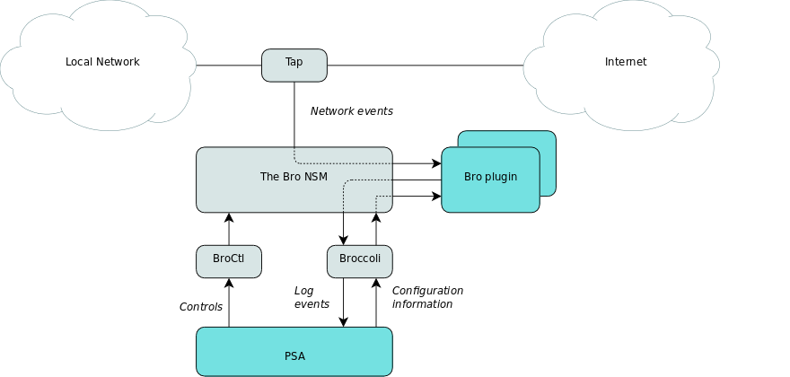

# 1. End-user

## 1.1 Description / general readme

Bro PSA provides network monitoring capabilities to end users. It can be used to
monitor user's network traffic according to specified policies and log security
related events, such as suspicious connections and suspected malicious files.

## 1.2 Features / Capabilities

The list of capabilities supported by this PSA includes:

* Logging of established connections during certain time interval filtered based
  on source and/or destination addresses and ports. Log events can be configured
  to trigger only if the amount of specified events exceeds certain threshold
  within a time interval. This capability may be used, e.g., log network usage
  or detect abnormal network traffic.

* Scanning downloaded files for known malware. This PSA's malware detection
  capabilities are based on detecting certain types of files, e.g. PDFs, in the
  network traffic to or from the user's device. The PSA computes hashes of such
  files and compares these against a repository of known hashes of malicious
  files. Type of files that are to be scanned can be configured.

## 1.3 Security policy examples

Examples of the policies that can be enables using the SECURED GGUI includes:

```I; Enable; Logging;  {propose, count_connection }; {traffic_target, address}```

- This policy enables logging of all connections to or from a specific address.

```I; Enable; Malware_detection; {type_Content, scan_xdosexec } ```

- This policy enables scanning of all Windows native executable files detected
  in the network traffic.

## 1.4 Support, troubleshooting / known issues

None

# 2. Developer / admin

## 2.1 Description / general readme

The Bro PSA provides network monitoring capabilities to end users. It can be
used to monitor user's network traffic according to specified policies and log
security related events, such as suspicious connections and suspected malicious
files.

The Bro PSA is implemented using the [Bro Network Security Monitoring platform](https://www.bro.org).
Bro is a passive network traffic analyzer primarily used for security monitoring
of suspicious activities in network traffic flows. It is an open-source software
with BSD-style license. More detailed description of The Bro NSM can be found in
[Bro NSM documentation](https://www.bro.org/documentation/index.html).

## 2.2 Components and Requirements

Software components used by the PSA include:

* [Bro Network Security Monitor](https://www.bro.org/)
* [BroControl](https://github.com/bro/broctl): An interactive interface for
  managing a Bro installation. Allows, e.g., starting and stopping the Bro NSM
  and updating its configuration. In the Bro PSA, this component is used for
  controlling the Bro NSM.
* [Broccoli](https://github.com/bro/broccoli): The Bro Client Communications
  Library. This component enables third-party applications to communicate
  directly with the Bro NSM by sending and receiving events using Bro's
  communication protocol. In the Bro PSA it is used to connect the PSA interface
  with the Bro policy scripts written as Bro plugin extensions.
* [Broccoli-python](https://github.com/bro/broccoli-python): Python bindings for
  Broccoli. Required, as the PSA interface is implemented using Python.

## 2.3 Detailed architecture

The Bro PSA is implemented using the Bro NSM.

Bro's architecture is illustrated below. Bro taps to network traffic in order to
captures network packets. These packets are sent to Event Engine that reduces
captured low-level packets to high-level network events, such as TCP
connections, SSL sessions events, or HTTP requests. High-level events are then
dispatched to Policy Script Interpreter that executes a set of event handlers to
the events. Policy scripts define the actual actions taken on each event. Each
policy script implements a set of event handlers. Events fired at policy scripts
may, for instance, produce logs or notifications about the network traffic, or
new events for other policy scripts.


Bro provides fully customizable and extensible platform for network traffic
analysis. It utilizes its own event-based, syntactically C-like, scripting
language with large set of pre-built functionalities. External C-library,
Broccoli, allows interfacing with third-party programs.

The Bro PSA is implemented as a separate Python application that interfaces with
the Bro NSM using Broccoli.

The architecture of the PSA is illustrated below. Each capability supported by
the PSA is implemented as its own Bro policy script (Bro plug-in). These policy
scripts determine what kind of information the PSA listens to and subscribe for
related network events in Bro's event stream. Plugins filter low-level network
events, e.g. establishment of connection to certain address and port, to higher
level log event for the PSA, e.g. *"there have been 100 connection attempts from
certain address to local port 80 within one minute"*.



The PSA uses two interfaces to communicate with the Bro NSM:
* BroControl is used to control the Bro NSM. For example, it is used to start
  and stop monitoring activities, as well as, to install new or remove old
  policy scripts (Bro plugins).
* Broccoli is used to pass configuration information to policy scripts and to
  receive log events from them.

Currently, two Bro plug-ins have been implemented:

* **Logging plug-in**: allows logging of established connections during certain
  time interval filtered based on source and/or destination addresses and ports.
  Log events can be configured to trigger only if the amount of specified events
  exceeds certain threshold within a time interval. This capability may be used,
  e.g., log network usage or detect abnormal network traffic.

* **Malware Detection plug-in**: allows scanning of downloaded files for known
  malware. This PSA's malware detection capabilities are based on detecting
  certain types of files, e.g. PDFs, in the network traffic to or from the
  user's device. The PSA computes hashes of such files and compares these
  against a repository of known hashes of malicious files. Type of files that
  are to be scanned can be configured.

## 2.4 Virtual machine image creation

See [PSA Developer guide](https://github.com/SECURED-FP7/secured-psa-develop-test)
for creating a virtual machine base image.

After obtaining the base image, install the following software components into
the image:

* Bro Network Security Monitor ([installation instructions](https://github.com/bro/bro/blob/master/doc/install/install.rst)).
* BroControl ([installation instructions](https://github.com/bro/broctl/blob/master/doc/broctl.rst))
* Broccoli ([installation instructions](https://github.com/bro/broccoli/blob/master/README))
* Broccoli-python ([installation instructions](https://github.com/bro/broccoli-python/blob/master/README))

**NOTE**: Bro PSA has been developed and tested on Bro NSM version 2.4+, it is required to use Bro NSM
version 2.4+, as the Bro policy scripts (plug-ins) might not work correctly in
other versions.

Copy [Bro PSA](PSA) files
into the following folder in the base image:

```
$HOME/pythonScript/
```

Configure Bro and BroCtl (default: /opt/bro/etc/broctl.cfg). At least the
following options should be set:

```
BroArgs = -b
```

* This option sets the Bro NSM to operate on 'bare mode' in an attempt to
  minimize its resource usage. This causes many of Bro's default scripts and
  policies not to be loaded when the Bro NSM starts.

```
SitePolicyStandalone = <$HOME>/pythonScript/secured.bro
```

* This option defines local Bro policies to be taken from SECURED specific
  policy file. This policy file is provided with the PSA
  [secured.bro](PSA/secured.bro) and the file path should be modified to match
  the Bro PSA installation.

Change passwords for users 'root' and 'psa' for security reasons.

## 2.5 Support, troubleshooting / known issues

Known issues:

* Connection counting / logging capability currently can only handle detection
  intervals on granularity of one minute.

* Bro NSM might not be able to handle all network traffic packets, e.g., due to
  congestion or because it does not have enough resources allocated. In such
  case it starts to drop packets, which may cause monitoring module to miss part
  of the network traffic. This might cause Malware Detection capability to miss
  malicious files as the currently used detection technique relies on file
  hashes which cannot be calculated to partial files.

## 2.6 Files required

The following files are needed to run Bro PSA correctly:

### PSA application image

The procedure to create a valid PSA image from scratch starts with the prerequisite instructions defined in the PSA Developer guide.

The PSA VM image (KVM) is available at [Bro](https://vm-images.secured-fp7.eu/images/) ([checksums](https://vm-images.secured-fp7.eu/images/)). 

***NOTE**: You have to manually change the PSA ID to *BroLogging/BroMalware* in PSA conf (PSA/psaEE.conf), change the VM image name in copy_psa_sw_to_vm.sh to the name required by SPM/UPR (and possibly legacy NED's JSON PSA Manifest) if tested in a fully integrated environment and and run the copy script. For a local test setup you can use the default image name, just replace the configuration file from NED files as desired. This is due to the capability differentiation in the policy framework.


### Manifest

The PSA Manifests are available at [BroLogging](NED_files/TVDM/PSAManifest/brologging_manifest.xml) and [BroMalware](NED_files/TVDM/PSAManifest/bromalware_manifest.xml) (and [legacy JSON format for old NED and manual testing](NED_files/TVDM/PSAManifest/broPSA)).

### HSPL

Examples of HSPL:

```I; Enable; Logging;  {propose, count_connection }; {traffic_target, address}```

- This policy enables logging of all connections to or from a specific address.

```I; Enable; Malware_detection; {type_Content, scan_xdosexec } ```

- This policy enables scanning of all Windows native executable files detected
  in the network traffic.

### MSPL

Example MSPLs can be found below:

 * [Logging](M2LPlugin/examples/example_mspl_log_2.xml)
 * [Malware Detection](M2LPlugin/examples/example_mspl_mwd_2.xml)

### M2L Plug-in

The M2L plug-in is available at [M2LPlugin](M2LPlugin). Notice that it contains separate plug-ins for BroLogging and BroMalware.

## 2.7 Features/Capabilities

Bro PSA provides the following capabilities

The list of capabilities are:
* Logging
* Offline_malware_analysis

## 2.8 Testing

Test scripts are available in the test [directory](tests) or in PSA/test.

# 3. License

Please refer to project [LICENSE](LICENSE) file.

This software requires several open source software components with their own license:

* Bro Network Security Monitor, available at [license](https://raw.githubusercontent.com/bro/bro/master/COPYING)
* BroControl, available at [license](https://raw.githubusercontent.com/bro/broctl/master/COPYING)
* Broccoli, available at [license](https://raw.githubusercontent.com/bro/broccoli/master/COPYING)
* Broccoli-python, available at [license](https://raw.githubusercontent.com/bro/broccoli-python/master/COPYING)

# 4. Additional Information

## 4.1 Partners involved

* Application: VTT
* MSPL: POLITO, VTT
* M2L Plugin: VTT

# 5. Status (OK/No/Partial) - OK

# 6. TODO-list

* Instructions for adding new Bro plug-ins to Bro PSA

